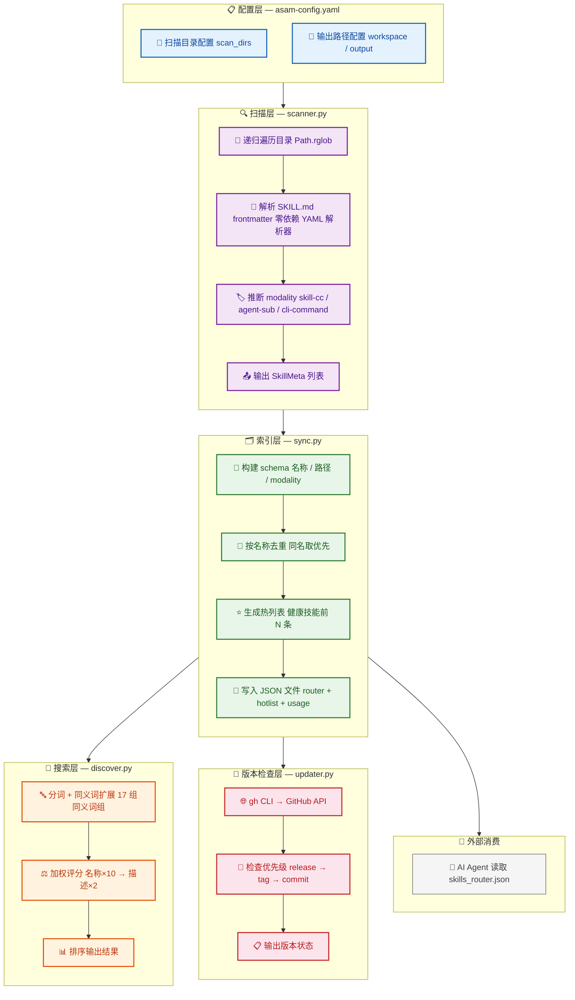
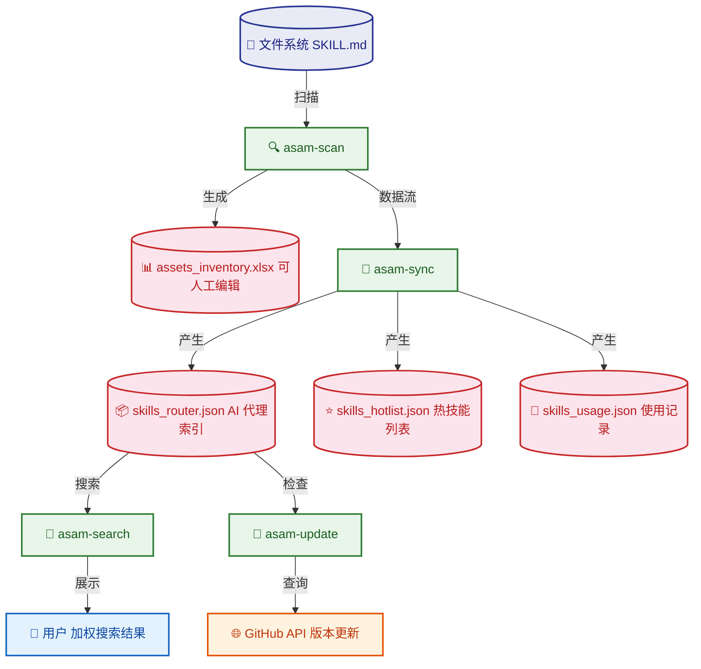

<div align="center">


# ASAM — Agent Skill Asset Manager（Agent 技能资产管理器）

[]()
[](LICENSE)

**扫描 → 索引 → 搜索** 你的 AI 代理技能库。

简体中文 | [English](README_EN.md)

</div>

ASAM 自动发现文件系统中的 AI 代理技能（带有 YAML frontmatter 的 SKILL.md 文件），构建带加权评分和同义词扩展的可搜索索引，导出 AI 代理可消费的 JSON 路由表——全程无需数据库服务。

---

## 目录

- [为什么需要 ASAM](#为什么需要-asam)
- [架构](#架构)
- [核心原理](#核心原理)
- [功能特性](#功能特性)
- [安装](#安装)
- [快速开始](#快速开始)
- [命令参考](#命令参考)
- [配置参考](#配置参考)
- [数据模型](#数据模型)
- [输出文件](#输出文件)
- [注意事项](#注意事项)
- [项目布局](#项目布局)
- [依赖说明](#依赖说明)
- [开发](#开发)
- [许可](#许可)

---

## 为什么需要 ASAM

如果你维护着 AI 代理技能的集合——无论是个人使用的、团队共享的还是开源的——你一定遇到过这些问题：

- "我记得有个技能能做这个，在哪儿来着？"
- "我是不是已经有一个做 markdown 转 PPT 的东西了？"
- "这个技能有 GitHub 新版本了，我本地是不是落后了？"

ASAM 用一条 CLI 命令解决这些问题。它适合以下场景：

| 场景 | 说明 |
|------|------|
| **Claude Code 重度用户** | 积累了数十个自定义 skill，搜索靠 grep |
| **AI Agent 开发者** | 需要自动发现当前可用的技能集 |
| **团队共享 skill 库** | 多人维护一个 skill 目录，需要索引和一致性检查 |
| **开源 skill 集合维护者** | 需要追踪上游版本变化 |

---

## 架构



### 数据流



---

## 核心原理

### 1. 技能发现（Scanner）

ASAM 的核心是一个目录扫描器，它做三件事：

- **递归遍历**扫描目录下的所有文件（使用 `Path.rglob("*")`）
- **解析 frontmatter**提取 `name`、`description`、`aliases`、`triggers`、`user-invocable` 等字段
- **推断 modality**根据文件路径中的子目录名（`skills/` → `skill-cc`、`agents/` → `agent-sub`）自动分类

**关键设计决策：零依赖 frontmatter 解析。** ASAM 内建了一个约 30 行的简易 YAML 解析器，支持 `key: value`、`- list item` 和 `[inline, list]` 三种格式。这意味着即使没有安装 `pyyaml`，扫描和搜索功能仍然可用。

### 2. 加权搜索（Discover）

搜索使用一种简单的 TF 风格的加权评分模型：

| 字段 | 权重 | 理由 |
|------|------|------|
| `name`（名称） | ×10 | 名称匹配是最强的信号 |
| `aliases`（别名） | ×8 | 别名通常指向同一概念 |
| `triggers`（触发词） | ×7 | 用户设置的触发词高度相关 |
| `tags`（标签） | ×5 | 标签是人工分类信号 |
| `modality`（形态） | ×3 | 类型匹配 |
| `category`（类别） | ×3 | 类别匹配 |
| `example`（示例） | ×2 | 命令示例 |
| `description`（描述） | ×2 | 描述文本（最长但信号最弱） |

**同义词扩展**使用预定义的 17 组同义词（如 `presentation ← ppt ← slides ← slide-deck`），将搜索词扩展后以 0.5 的权重参与评分。这确保搜索 "ppt" 也能找到标记为 "presentation" 的技能。

### 3. 版本检查（Updater）

通过 `gh` CLI（已认证时）或直接调用 GitHub API，按优先级尝试获取最新版本：

```
1. 最新 Release → tag_name
2. 最新 Tag    → name
3. 默认分支 HEAD → commit SHA (前 8 位)
4. 回退        → pushed_at 日期
```

---

## 功能特性

- **目录扫描器** — 递归遍历配置目录，解析 SKILL.md frontmatter，提取结构化元数据
- **加权搜索** — 按名称(×10)、别名(×8)、描述(×2) 等字段加权的相关性评分搜索
- **同义词扩展** — 17 组领域同义词组自动扩展搜索结果
- **版本追踪** — 检查 GitHub 仓库的最新 release/tag（需要 `gh` CLI）
- **JSON 路由表** — 导出 AI 代理可消费的扁平 JSON 索引
- **零外部数据库** — 全部基于文件：JSON 索引 + 可选人工可编辑的 Excel
- **离线可用** — 扫描和搜索完全离线，版本检查为可选在线功能

---

## 安装

```bash
# 从源码安装（推荐）
git clone https://github.com/cikorsky/agent-skill-asset-manager.git
cd aim
pip install -e .

# 可选：Excel 支持
pip install -e ".[excel]"

# 完整安装
pip install -e ".[all]"

# 发布到 PyPI 后：
# pip install asam
```

### 通过 pipx 安装（隔离环境）

```bash
pipx install .
# 或
pipx install asam  # PyPI 发布后
```

---

## 快速开始

### 1. 配置

在项目根目录创建 `asam-config.yaml`：

```yaml
workspace: ./results
scan_dirs:
  - path: ~/.agents/skills
    type: skill-cc
  - path: ./vendor/skills
    type: doc-reference
```

### 2. 扫描

```bash
$ asam-scan
Discovered: 395 skills
  New:      0
  Updated:  380
  Healthy:  0
  PathFixed:9
  Skipped:  15
```

应用变更以持久化索引：

```bash
asam-scan --apply
```

### 3. 搜索

```bash
$ asam-search "markdown presentation" --top 5
  1. [skill-cc    ] lovstudio-any2pdf      Convert Markdown documents to PDF [...]
  2. [skill-cc    ] magic-slide            HTML presentation with Magic Move [...]
  3. [doc-reference] ppt-master            AI-driven PPTX generation [...]
  4. [skill-cc    ] oh-my-ppt              Local-first AI PPT generation [...]
  5. [doc-reference] glmv-pdf-to-ppt       PDF to presentation slides [...]

# 按形态过滤 + JSON 输出
$ asam-search "testing" --modality skill-cc --json

# 精确搜索模式：使用引号包裹短语
$ asam-search "code review"

# 别名搜索（同义词起作用）
$ asam-search "ppt"
# 也会找到标记为 "presentation" 或 "slides" 的技能
```

### 4. 构建搜索索引

```bash
$ asam-sync
Sync Successful: 1007 skills indexed to JSON.
```

### 5. 检查版本更新

```bash
$ asam-update
  ✓ lovstudio-any2pdf    v1.2.0      → v1.3.0
  ✓ my-skill             abc1234     → def5678
```

---

## 命令参考

| 命令 | 说明 | 关键选项 |
|------|------|---------|
| `asam-scan` | 扫描目录，报告变更 | `--apply` 写入索引，`--health-check` 验证路径，`--json` 机器输出 |
| `asam-sync` | 扫描 + 构建 JSON 索引 | `--hotlist-size N` |
| `asam-search <query>` | 加权搜索 | `--top N` 最大结果，`--modality X` 过滤，`--json` |
| `asam-update` | 检查 GitHub 版本 | `--json` 机器输出 |

所有命令都支持 `--config <path>` 指定显式配置文件路径。

---

## 配置参考

```yaml
# ASAM Configuration
# 复制此文件到项目根目录并修改

# 输出工作目录（JSON/Excel 文件写入位置）
workspace: ./results

# 输出文件名（相对于 workspace）
excel: assets_inventory.xlsx
router: skills_router.json
hotlist: skills_hotlist.json
usage: skills_usage.json

# 热技能列表大小
hotlist_size: 20

# 同义词词典路径（可选，留空则不使用）
synonyms: ./data/synonyms.json

# 要扫描的目录列表
# 每个条目包含：
#   path: 文件路径（支持 ~/ 展开）
#   type: skill-cc | doc-reference | agent-sub | cli-command | mcp-server
scan_dirs:
  - path: ~/.agents/skills
    type: skill-cc
  - path: ./vendor/skills
    type: doc-reference
```

### 扫描目录类型说明

| 类型 | 含义 | 自动检测子目录 |
|------|------|--------------|
| `skill-cc` | Claude Code 斜杠命令技能 | `skills/` |
| `agent-sub` | 子代理定义 | `agents/` |
| `cli-command` | CLI 命令 | `commands/` |
| `doc-reference` | 文档或参考 | _(默认)_ |
| `mcp-server` | MCP 服务器配置 | — |

---

## 数据模型

ASAM 读取带有 YAML frontmatter 的 SKILL.md 文件：

```yaml
---
name: my-skill
description: 这是一个非常有用的技能
aliases: ["useful", "helper"]
user-invocable: true
triggers:
  - "做某事"
argument-hint: "参数提示"
---
# My Skill

详细的描述和使用说明。
```

提取的字段说明：

| 字段 | 是否必须 | 用途 |
|------|---------|------|
| `name` | ✅ 是 | 技能名称，也是搜索的关键标识 |
| `description` | ❌ 否 | 搜索描述字段，用于结果展示 |
| `aliases` | ❌ 否 | 别名列表，参与搜索加权（×8） |
| `triggers` | ❌ 否 | 触发词列表，参与搜索加权（×7） |
| `user-invocable` | ❌ 否 | 如果为 `true`，分类为斜杠命令（`skill-cc`） |

当 `user-invocable: true` 时，技能被分类为**斜杠命令**（`/my-skill`）。
否则被视为**参考文档**（`doc-reference`）。

---

## 输出文件

所有文件写入配置的 `workspace` 目录。

| 文件 | 格式 | 内容 |
|------|------|------|
| `skills_router.json` | JSON | 完整索引：每个技能的元数据和路径 |
| `skills_hotlist.json` | JSON | Top-N 热技能列表（适合注入 AI 代理上下文） |
| `skills_usage.json` | JSON | 使用记录存储（可选，追加写入） |
| `assets_inventory.xlsx` | Excel | 可人工编辑的电子表格（需要 pandas + openpyxl） |

### skills_router.json 结构

```json
[
  {
    "name": "my-skill",
    "category": "skills",
    "modality": "skill-cc",
    "path": "/path/to/skill/SKILL.md",
    "description": "技能描述",
    "tags": "关键词1, 关键词2",
    "example": "/my-skill",
    "health": "healthy"
  }
]
```

---

## 注意事项

### 已知限制

| 限制 | 说明 | 影响 |
|------|------|------|
| **前题文解析器不支持嵌套** | 内建 YAML 解析器只支持 `key: value` 和 `- list`，不支持多级嵌套字典 | 绝大多数 SKILL.md 的 frontmatter 是扁平的，不受影响 |
| **同义词词典是静态的** | 17 组同义词是预定义的，用户需要扩展时需手动编辑 `synonyms.json` | 对中文搜索支持有限（建议将中文同义词添加到词典中） |
| **Excel 依赖 pandas** | 如果不安装 pandas，Excel 导出功能不可用（JSON 索引不需要它） | JSON 功能完全不受影响 |
| **版本检查依赖 gh CLI** | 需要预先通过 `gh auth login` 认证，没有 gh 时跳过 | 扫描和搜索完全离线工作 |
| **CJK 分词简单** | 中文/日文/韩文文本被整体作为一个 token 处理，不会分词 | 中文搜索需要更精确的查询，建议使用 --json 查看完整结果 |
| **不支持监听模式** | ASAM 不会自动检测文件变化，需要手动运行 `asam-scan` | 可以通过 cron 或 git hook 触发定期扫描 |

### 最佳实践

1. **定期运行 `--health-check`** — 验证索引中的路径仍然有效
2. **CI/CD 中集成 `asam-scan`** — 在 skill 仓库的 CI 流程中添加扫描步骤
3. **使用 `--json` 输出** — 结合 jq 等工具进行自动化处理
4. **保持 synonyms.json 更新** — 添加你的领域特定同义词以获得更好的搜索效果

### 与 Claude Code 的集成

ASAM 最初设计用于 Claude Code skill 的管理，但它的设计是通用的。如果你使用 Claude Code：

```bash
# 设置扫描你的技能目录
cat > asam-config.yaml << 'EOF'
workspace: ./results
scan_dirs:
  - path: ~/.agents/skills
    type: skill-cc
  - path: ~/.claude/skills
    type: skill-cc
EOF

# 构建索引
asam-scan --apply
asam-sync

# 在 Claude Code 的 CLAUDE.md 中添加引用：
# 当用户提问时，先执行 asam-search 查找相关技能
```

---

## 项目布局

```
src/aim/
├── __init__.py     包元数据和版本信息
├── config.py       配置加载器 — YAML 或回退解析器
├── models.py       数据模型 + frontmatter 解析器（零依赖）
│   ├── SkillMeta dataclass
│   ├── ScanDir dataclass
│   ├── parse_frontmatter()
│   └── infer_modality()
├── scanner.py      目录遍历 + SKILL.md 提取器
│   ├── scan_directory()     — 扫描单个目录
│   ├── scan_all()            — 扫描所有配置目录
│   ├── diff_against_index()  — 与现有索引对比
│   └── health_check()        — 验证路径有效性
├── sync.py          JSON 路由表 / 热列表构建器
│   ├── build_router() — 构建索引数据结构
│   ├── write_json()   — 写入 JSON 文件
│   └── sync()          — 全流程：扫描→构建→写入
├── discover.py      加权搜索 + 同义词扩展
│   ├── tokenize()        — 分词
│   ├── expand_query()    — 同义词扩展
│   ├── field_score()     — 单字段评分
│   ├── score_skill()     — 技能总评分
│   └── search()          — 搜索入口
├── updater.py       GitHub 版本检查器
│   ├── parse_github_url()  — URL 解析
│   ├── gh_api()            — GitHub API 调用
│   ├── fetch_latest_version() — 获取最新版本
│   └── check_skill()       — 检查单个技能
└── cli.py           CLI 入口点 (asam-scan, -sync, -search, -update)
    ├── scan_main()      — asam-scan
    ├── sync_main()      — asam-sync
    ├── search_main()    — asam-search
    └── update_main()    — asam-update
```

---

## 依赖说明

| 依赖 | 是否必须 | 用途 |
|------|---------|------|
| Python ≥ 3.10 | ✅ 必须 | 运行时 |
| `pyyaml ≥ 6.0` | 推荐 | 配置文件解析（有零依赖回退） |
| `pandas ≥ 2.0` | 可选 | Excel 导出 |
| `openpyxl ≥ 3.0` | 可选 | Excel 导出 |
| `gh` CLI | 可选 | 版本更新检查 |

### 零依赖保证

即使没有任何第三方包，以下功能仍然可用：
- ✅ 扫描目录（标准库 `pathlib` + `os`）
- ✅ frontmatter 解析（内建 YAML 解析器）
- ✅ 搜索和评分
- ✅ JSON 索引构建
- ✅ CLI 交互

唯一需要外部依赖的是：
- ❌ Excel 导出（需要 pandas + openpyxl）
- ❌ 配置文件使用 YAML 语法时（有 TOML 风格的回退解析器）
- ❌ 版本更新检查（需要 gh CLI）

---

## 开发

```bash
git clone https://github.com/cikorsky/agent-skill-asset-manager.git
cd aim
pip install -e ".[all]"

# 运行测试
python3 -m pytest tests/
```

### 添加新功能

1. 在 `src/aim/` 中添加对应模块
2. 更新 `cli.py` 中的入口点
3. 在 `tests/` 中添加测试
4. 运行 `python3 -m pytest tests/` 确保全部通过

---

## 许可

MIT — 详见 [LICENSE](LICENSE)。
