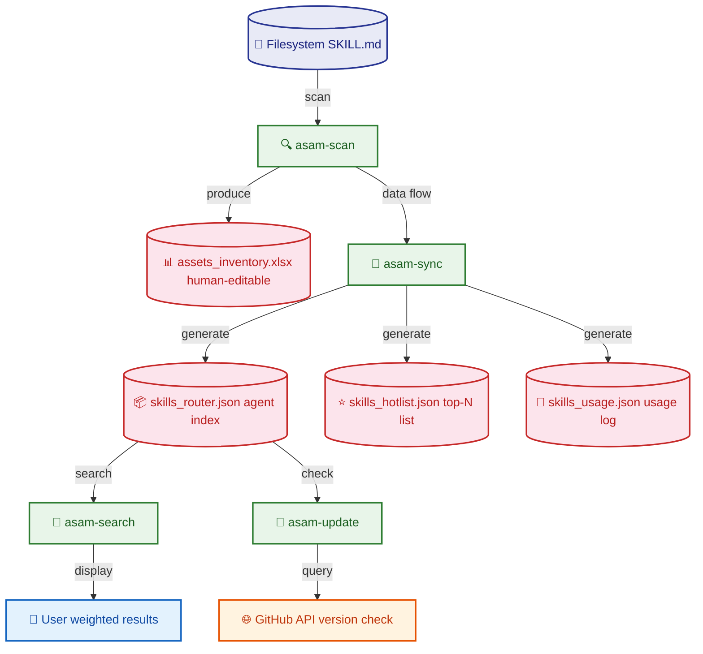

<div align="center">


# ASAM — Agent Skill Asset Manager

[]()
[](LICENSE)
[]()

**Scan → Index → Search** your AI agent skill libraries.

[简体中文](README.md) | English

</div>

ASAM discovers agent skills (SKILL.md files with YAML frontmatter) across
your filesystem, builds a searchable index with weighted scoring and
synonym expansion, and exports a JSON router consumable by AI agents —
all without a database server.

---

## Why ASAM?

If you maintain a collection of AI agent skills — whether personal,
team-shared, or open-source — you've experienced:

- "I know there's a skill for this somewhere, but where?"
- "Did I already have something that does markdown-to-PPT?"
- "This skill has a GitHub release, is mine outdated?"

ASAM solves these with a single CLI command.

## Features

- **Directory scanner** — Recursively walks configured directories,
  parses SKILL.md frontmatter, and extracts structured metadata
- **Weighted search** — Relevance-scored search across skill name,
  description, tags, triggers, and aliases (name matches ×10,
  description ×2, etc.)
- **Synonym expansion** — 17 domain-specific synonym groups (e.g.
  "ppt" ↔ "presentation" ↔ "slide-deck") broaden search coverage
- **Version tracking** — Checks GitHub repositories for the latest
  release or tag of each skill (requires `gh` CLI)
- **JSON router** — Exports a flat JSON index consumable by AI agents
  and automation pipelines
- **Zero external database** — Everything is file-based: JSON index +
  optional human-editable Excel

## Installation

```bash
# From source (recommended for now)
git clone https://github.com/cikorsky/agent-skill-asset-manager.git
cd aim
pip install -e .

# Optional: Excel support
pip install -e ".[excel]"

# Or install with all extras
pip install -e ".[all]"

# Once published on PyPI:
# pip install asam
```

## Architecture

```mermaid
graph TB
 classDef config fill:#e3f2fd,stroke:#1565c0,stroke-width:2px,color:#0d47a1
 classDef scan fill:#f3e5f5,stroke:#7b1fa2,stroke-width:2px,color:#4a148c
 classDef index fill:#e8f5e9,stroke:#2e7d32,stroke-width:2px,color:#1b5e20
 classDef search fill:#fff3e0,stroke:#e65100,stroke-width:2px,color:#bf360c
 classDef update fill:#fce4ec,stroke:#c62828,stroke-width:2px,color:#b71c1c
 classDef ext fill:#f5f5f5,stroke:#616161,stroke-width:1px,color:#424242,dashed

 subgraph Config["📋 Config Layer — asam-config.yaml"]
 direction TB
 C1[📁 Scan directories scan_dirs]
 C2[📁 Output paths workspace / file names]
 end

 subgraph Scan["🔍 Scan Layer — scanner.py"]
 direction TB
 S1[📂 Recursive walk Path.rglob("*")]
 S2[📄 Parse SKILL.md zero-dependency YAML parser]
 S3[🏷️ Infer modality skill-cc / agent-sub / cli-command]
 S4[📤 Output SkillMeta list]
 S1 --> S2 --> S3 --> S4
 end

 subgraph Index["🗂️ Index Layer — sync.py"]
 direction TB
 I1[📐 Build schema name / path / modality / tags]
 I2[🔗 Deduplicate by name first occurrence wins]
 I3[⭐ Generate hotlist top-N healthy skills]
 I4[💾 Write JSON files router + hotlist + usage]
 I1 --> I2 --> I3 --> I4
 end

 subgraph Search["🔎 Search Layer — discover.py"]
 direction TB
 D1[🔤 Tokenize + synonyms 17 domain-specific groups]
 D2[⚖️ Weighted scoring name×10 → desc×2]
 D3[📊 Ranked results]
 D1 --> D2 --> D3
 end

 subgraph Update["🔄 Version Check — updater.py"]
 direction TB
 U1[🌐 gh CLI → GitHub API]
 U2[📡 Fetch priority release → tag → commit]
 U3[📋 Version status]
 U1 --> U2 --> U3
 end

 subgraph External["🤖 External"]
 E[🧠 AI Agent consumes skills_router.json]
 end

 Config --> Scan
 Scan --> Index
 Index --> Search
 Index --> Update
 Index --> External

 class C1,C2 config
 class S1,S2,S3,S4 scan
 class I1,I2,I3,I4 index
 class D1,D2,D3 search
 class U1,U2,U3 update
 class E ext
```

## Quick start

### 1. Configure

Create `asam-config.yaml` in your project root:

```yaml
workspace: ./results
scan_dirs:
  - path: ~/.agents/skills
    type: skill-cc
  - path: ./vendor/skills
    type: doc-reference
```

### 2. Scan

```bash
$ asam-scan
Discovered: 395 skills
  New:      0
  Updated:  380
  Healthy:  0
  PathFixed:9
  Skipped:  15
```

Apply changes to persist the index:

```bash
asam-scan --apply
```

### 3. Search

```bash
$ asam-search "markdown presentation" --top 5
  1. [skill-cc    ] lovstudio-any2pdf          Convert Markdown documents to professionally typeset PDF files [...]
  2. [skill-cc    ] magic-slide                Generate a self-contained HTML presentation with Magic Move [...]
  3. [doc-reference] ppt-master                AI-driven native PPTX generation from markdown [...]
  4. [skill-cc    ] oh-my-ppt                  Local-first AI PPT generation desktop app [...]
  5. [doc-reference] glmv-pdf-to-ppt           Convert PDF to presentation slides [...]

# Filter by modality
$ asam-search "testing" --modality skill-cc --json
```

### 4. Check for updates

```bash
$ asam-update
  ✓ my-skill             v1.2.0      → v1.3.0
  ✓ another-skill        abc1234     → def5678
```

## Commands

| Command | Description | Key options |
|---------|-------------|-------------|
| `asam-scan` | Scan directories, report changes | `--apply` write index, `--health-check` validate paths, `--json` machine output |
| `asam-sync` | Scan + build JSON router index | `--hotlist-size N` |
| `asam-search <query>` | Weighted search | `--top N` max results, `--modality X` filter, `--json` |
| `asam-update` | Check GitHub versions | `--json` machine output |

All commands accept `--config <path>` for an explicit config file.

## Configuration reference

| Key | Default | Description |
|-----|---------|-------------|
| `workspace` | `./results` | Output directory for JSON/Excel files |
| `scan_dirs` | `[]` | List of `{path, type}` entries to scan |
| `synonyms` | `""` | Path to synonym JSON file (optional) |
| `hotlist_size` | `20` | Number of entries in hotlist |
| `router` / `hotlist` / `usage` | `skills_*.json` | Output filenames |

**Scan directory types:**

| Type | Meaning | Auto-detected from subdir |
|------|---------|--------------------------|
| `skill-cc` | Claude Code slash-command skill | `skills/` |
| `agent-sub` | Sub-agent definition | `agents/` |
| `cli-command` | CLI command | `commands/` |
| `doc-reference` | Document or reference | _(default)_ |
| `mcp-server` | MCP server config | — |

## Data model

ASAM reads SKILL.md files with YAML frontmatter:

```yaml
---
name: my-skill
description: Does something useful
aliases: ["useful", "helper"]
user-invocable: true
triggers:
  - "do something"
---
```

Extracted fields: `name`, `description`, `aliases`, `triggers`, `user-invocable` → modality inference.

When `user-invocable: true`, the skill is classified as a **slash-command**
(`/my-skill`). Otherwise it is treated as a **reference document**.

## Output files

All files are written to the configured `workspace` directory.

| File | Format | Contents |
|------|--------|----------|
| `skills_router.json` | JSON | Full index: every skill with all metadata fields |
| `skills_hotlist.json` | JSON | Top-N skills (useful for agent context injection) |
| `skills_usage.json` | JSON | Usage tracking store (opt-in, append-only) |
| `assets_inventory.xlsx` | Excel | Human-editable spreadsheet (requires pandas + openpyxl) |

## Project layout

```
src/aim/
├── __init__.py     Package metadata
├── config.py       Config loader — YAML or fallback parser
├── models.py       SkillMeta dataclass + frontmatter parser (zero deps)
├── scanner.py      Directory walker + SKILL.md extractor
├── sync.py         JSON router / hotlist builder
├── discover.py     Weighted search + synonym expansion
├── updater.py      GitHub version checker (gh CLI)
└── cli.py          CLI entry points (asam-scan, -sync, -search, -update)
```

## Requirements

| Dependency | Required? | For |
|------------|-----------|-----|
| Python ≥ 3.10 | ✅ | Runtime |
| `pyyaml ≥ 6.0` | Recommended | Config file parsing |
| `pandas ≥ 2.0` | Optional | Excel export |
| `openpyxl ≥ 3.0` | Optional | Excel export |
| `gh` CLI | Optional | Version checking |

## Development

```bash
git clone https://github.com/cikorsky/agent-skill-asset-manager.git
cd aim
pip install -e ".[all]"
python3 -m pytest tests/
```

## License

MIT — see [LICENSE](LICENSE).
